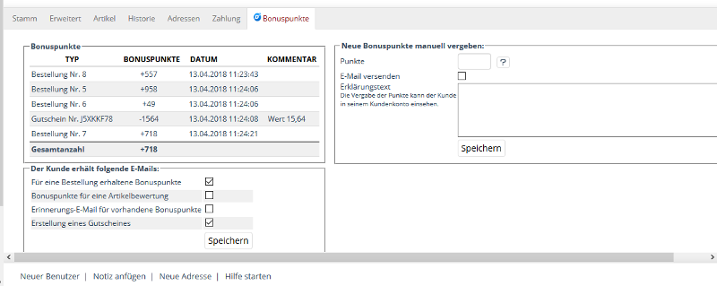
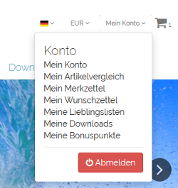

Um die erfolgreiche Installation zu prüfen, können Sie die folgende(n) Checkliste(n) verwenden:

## Einstellungsunabhängige Prüfungen
### Backend
* Modul ist unter [ Erweiterungen ] -> [ Module ] aktiv geschaltet
* Modul ist unter [ D3 Module ] -> [ Modul-Connector ] -> [ Modulverwaltung ] aktiv geschaltet
* Modul zeigt unter [ D3 Module ] -> [ Bonuspunkte ] einen eigenen Bereich für Einstellungen
* Modul zeigt unter [ Benutzer verwalten ] -> [ Benutzer ] einen eigenen Tab für Einstellungen:
    

### Frontend
* Einbindung im Flyout-Menü im Header:
    
* Modul zeigt einen Menüpunkt [ Meine Bonuspunkte ] unter [ Konto ]
    